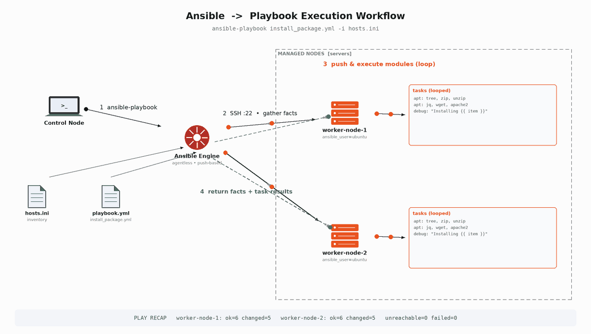
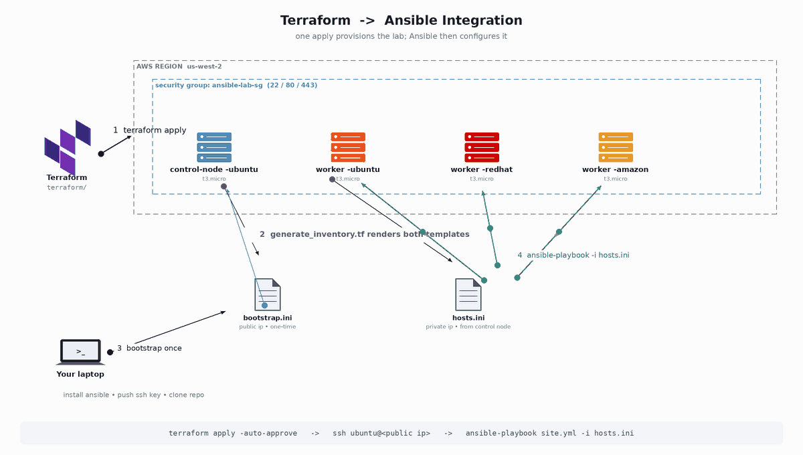
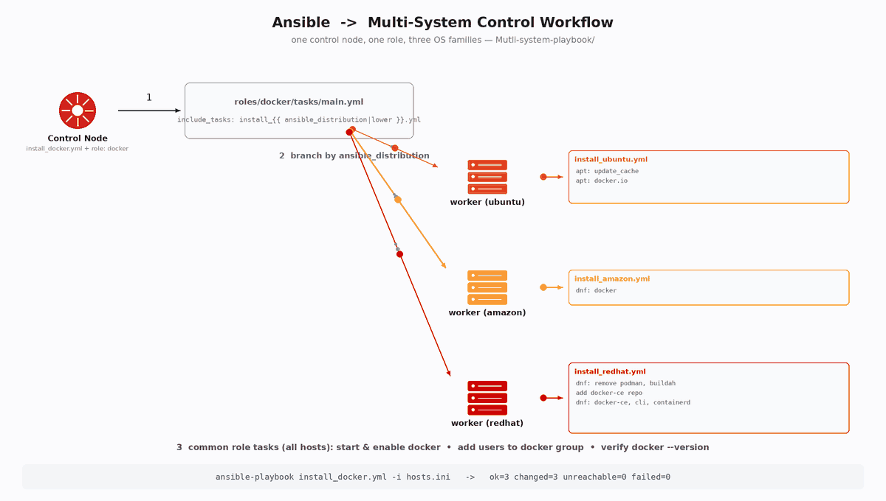

# 🚀 Ansible Learning Hub

A hands-on, module-by-module repository for learning **Ansible** — from ad-hoc commands to roles, dynamic templating, multi-tier playbooks, and real integrations with **Terraform**, **Docker**, and **CI/CD (Jenkins)**.

This repo is structured the way you'd actually *learn* Ansible on the job: start with commands, move to playbooks, then variables, roles, templates, multi-system orchestration, and finally real-world projects.

---

## 📁 Repository Structure

```
Ansible-Learning-Hub/
│
├── 01-basics/                     # Ad-hoc commands, inventory basics
│   ├── commands/                  # Cheat-sheet style command files
│   └── inventory/                 # Sample static inventories
│
├── 02-playbooks/                  # Your first playbooks
│   ├── hello-world.yml
│   └── install-nginx.yml
│
├── 03-variables-and-facts/        # Vars, group_vars, host_vars, facts
│   ├── group_vars/
│   ├── host_vars/
│   └── vars-demo.yml
│
├── 04-roles/                      # Role-based structure (best practice)
│   └── webserver/
│       ├── tasks/
│       ├── handlers/
│       ├── templates/
│       ├── vars/
│       └── defaults/
│
├── 05-templates-jinja2/           # Jinja2 templating (.j2)
│   ├── nginx.conf.j2
│   └── template-demo.yml
│
├── 06-handlers-and-notifications/ # Handlers, notify, triggers
│   └── handlers-demo.yml
│
├── 07-multi-system-playbook/      # One playbook, one role, Docker across Ubuntu/Amazon/RHEL
│   ├── README.md
│   ├── install_docker.yml
│   └── roles/
│       └── docker/                # OS-aware role (branches on ansible_distribution)
│           ├── README.md
│           ├── defaults/
│           ├── handlers/
│           ├── meta/
│           ├── tasks/
│           ├── tests/
│           └── vars/
│
├── 08-terraform-integration/      # Provision with Terraform, configure with Ansible
│   ├── main.tf
│   └── configure.yml
│
├── 09-real-world-projects/        # End-to-end mini projects
│   ├── docker-deployment/
│   └── lamp-stack/
│
├── diagrams/                      # Visual flow diagrams (animated GIF + PNG)
│   ├── ansible-playbook-workflow.gif        # control node → inventory → modules → managed nodes
│   ├── ansible-terraform-integration.gif    # terraform apply → generated inventory → ansible-playbook
│   ├── ansible-multi-system-workflow.gif    # one control node → ubuntu / amazon / redhat → docker
│   └── 02-cicd-ansible-pipeline.png         # code → build → scan → configure/deploy → monitor
│
├── docs/
│   └── Ansible_Complete_Guide.pdf # Why Ansible, command basics, interview Q&A
│
├── linkedin/
│   ├── combined_workflow_diagram.png
│   └── linkedin_post.md
│
├── ansible.cfg
├── hosts.ini
└── LICENSE
```

---

## 🧭 Suggested Learning Path

| Step | Module | What you'll learn |
|------|--------|--------------------|
| 1 | `01-basics` | Inventory files, ad-hoc commands (`ping`, `copy`, `yum`, `service`) |
| 2 | `02-playbooks` | YAML syntax, tasks, modules, running your first playbook |
| 3 | `03-variables-and-facts` | Variable precedence, `group_vars`, `host_vars`, `setup` facts |
| 4 | `04-roles` | Breaking playbooks into reusable roles (Ansible Galaxy structure) |
| 5 | `05-templates-jinja2` | Dynamic config files using Jinja2 templates |
| 6 | `06-handlers-and-notifications` | Event-driven tasks with `notify` / `handlers` |
| 7 | `07-multi-system-playbook` | One role installing Docker across Ubuntu, Amazon Linux, and RHEL |
| 8 | `08-terraform-integration` | Provision infra (Terraform) → configure it (Ansible) |
| 9 | `09-real-world-projects` | Docker deployment & LAMP stack, start to finish |

---

## 🖼️ Flow Diagrams

### 1. Ansible Playbook Execution Workflow
How a playbook actually runs — control node parses the playbook and inventory, connects over SSH, gathers facts, pushes and loops modules on the managed nodes, then reports back in the play recap.




### 2. Terraform + Ansible Integration
`terraform apply` provisions the control node and workers on AWS, `generate_inventory.tf` renders the bootstrap and runtime inventories, and Ansible takes over from there — one-time bootstrap from your laptop, then `ansible-playbook` run from the control node over private IPs.



### 3. Multi-System Control Workflow
One control node, one `docker` role, three OS families. `include_tasks` branches by `ansible_distribution` (apt on Ubuntu, dnf on Amazon Linux, dnf + repo swap on RHEL), then converges on the same start/enable/verify steps across every host.




---

## ⚙️ Getting Started

```bash
# 1. Clone the repo
git clone https://github.com/Ibrahim-Naseef/Ansible-Learning-Hub.git
cd Ansible-Learning-Hub

# 2. Install Ansible
pip install ansible

# 3. Check connectivity to your inventory
ansible -i hosts.ini all -m ping

# 4. Run your first playbook
ansible-playbook -i hosts.ini 02-playbooks/hello-world.yml
```

---

## 📘 Docs

[`docs/Ansible_Complete_Guide.pdf`](docs/Ansible_Complete_Guide.pdf) covers:
- Why Ansible (vs Puppet/Chef/SaltStack)
- All essential CLI commands, cheat-sheet style
- Application/scenario-based interview questions with answers

---

## 🤝 Contributing

This is a personal learning repo, but PRs with better examples, fixes, or additional real-world project modules are welcome.

## 📄 License

MIT — see [LICENSE](LICENSE).